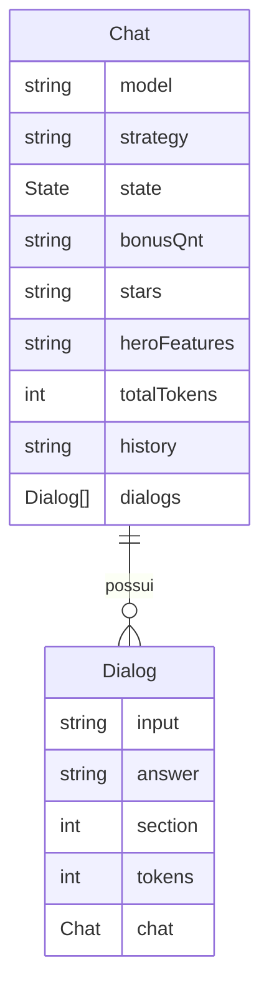

# API Blabinha2.0 (V2)

Um servidor HTTP REST, que expõe o chat-bot Blabinha através da rede, como um serviço de API, permitindo a criação de conversas utilizando diferentes modelos de LLMs e estratégias de prompt. Ligado ao projeto _Blabinha 2.0: um agente conversacional baseado em inteligência artificial generativa, especialista na Amazônia Azul_, do laboratório _Center for Artificial Intelligence_ (C4AI) da Universidade de São Paulo.

## _Features_

- Criar chats: sessões permanentes entre requisições;
- Criar diálogos (_dialogs_): uma seção de intenração com um chat;
- Recuperar dados sobre chats ou diálogos anteriores;
- Apagar dados referentes a chats e diálogos.

## Tecnologias utilizadas

- [FastAPI](https://fastapi.tiangolo.com/), para desenvolver os endpoints e o servidor _HTTP_;
- [SQLModel](https://sqlmodel.tiangolo.com/), para modelar a base de dados e validar as requisições;
- [Alembic](https://alembic.sqlalchemy.org/en/latest/), para organizar e rodar as migrações da base de dados;
- [SQLite](https://sqlite.org/index.html), a base de dados, para armazenar as interações com a Blabinha e armazenar _logs_;
- [UV package manager](https://docs.astral.sh/uv/), para genrenciar e instalar as dependências do projeto.

## Como usar a API

1. Crie um chat com `POST URL/chats`, opcionalmente, com o modelo de LLM desejado, a estratégia de prompt preferida, e a seção que se deseja começar, para iniciar do 'zero' o valor padrão é `100`. A resposta será em _json_, no modelo `Chat`, com o atributo de `id`. **Armazene esse id**;
2. Interaja com o chat por meio de diálogos, com `POST URL/dialogs`, enviando o **id do chat** e o **input desejado**, bem como a chave de API do modelo de LLM escolhido, através do _headers_ no campo `Authorization`, com o formato _Bearer_. A resposta será em _json_, no modelo `Dialog`, que contém a resposta gerada por IA, informações sobre aquela seção, e o `Chat` pertencente atualizado.

Veja um exemplo:

- Criando um chat
```bash
curl -X POST http://localhost:8000/chats -d '{"model": "gpt-4o"}' -H 'Content-Type: application/json'
```
- Criando dialogs
```bash
curl -X POST http://localhost:8000/dialogs -d '{"chat_id": X, "input": "Oi"}' -H 'Content-Type: application/json' -H 'Authorization: Bearer XXXXXXXX'
```

Para mais informações refira-se à documentação em `URL/docs`.

> `URL` refere-se ao endereço da que API está rodando, se ela estiver localmente, será algo como `http://localhost:8000`, ou similar. Em produção o endereço será fornecido pelo provedor.

### Windows

Antes de tudo verifique se o comando utilitário `curl` está instalado:
```bash
curl --version
```
Se sim, tudo está certo :smile, você pode seguir os exemplos anteriores. Caso contrário, siga este [link](https://curl.se/windows/), e instale o `curl` na sua máquina.

Ou utilize uma aplicação de software que testem requisições HTTP, como [Postman](https://www.postman.com/downloads/) ou [Insomnia](https://insomnia.rest/download).

## Como rodar a API

1. Clone este repositório: `git clone git@github.com:caio-bernardo/Blabinha2-API.git`;
1.2. **Recomenda-se fortemenete** o uso do package manager `uv`, a instalação é simples: `pip install uv`, se deseja mais informações [clique aqui](https://docs.astral.sh/uv/);
2. Crie um arquivo chamado `.env` seguindo o exemplo em `.env.example`. Preencha as variaveis de ambiente.
3. Crie a base de dados com o comando `uv run task migrate`. Verifique se um arquivo `db.sqlite3` foi criado na raíz do projeto.
3. Rode a API com o seguinte comando `uv run task run`

> Na primeira vez que você executar o _uv_ ele irá instalar todos os pacotes necessários e criar uma pasta _.venv_ na raíz do seu projeto. Essa pasta pode ser usada como ambiente virtual, e ativada com `source ./.venv/bin/activate` (e sua versão do Windows). Se decidir iniciar o ambiente virtual, pode executar todos os comandos demonstrados sem a necessidade do `uv run`.

## Desenvolvendo a API

1. Siga as instruções do tópico anterior
1. Para rodar a aplicação em **modo de desenvolvimento**, execute `uv run task dev`

> Lembre-se de criar uma nova _branch_, quando for fazer alterações ao código.

### Fazendo migrações

Ao fazer alterações nos modelos que representam tabelas, é preciso atualizar a base de dados, chamamos isso de **migrações**.
Para fazer isso é preciso executar o comando `alembic`. Veja o exemplo:

Para fazer uma migração:
```bash
alembic revision --autogenerate -m "campo adicionado na tabela x"
alembic upgrade head
```

Para reverter alterações:
```bash
alembic downgrade -1
```
### Estrutura do projeto
```
.
├── src/
│   ├── migrations/
│   ├── blabinha_api/
│   │   ├── blabinha/
│   │   │   └── Blab.py
│   │   ├── chats/
│   │   │   ├── models.py
│   │   │   ├── routes.py
│   │   │   ├── schemas.py
│   │   │   └── services.py
│   │   ├── dialogs/
│   │   │   ├── models.py
│   │   │   ├── routes.py
│   │   │   ├── schemas.py
│   │   │   └── services.py
│   │   ├── config.py
│   │   ├── models.py
│   │   ├── routes.py
│   │   ├── utils.py
│   │   ├── database.py
│   │   └── dependencies.py
│   └── main.py
├── test/
├── alembic.ini
├── pyproject.toml
└── README.md
```

#### Diretórios principais
- `src/`: Código-fonte principal da aplicação
- `test/`: Testes da aplicação
- `alembic.ini`: Configuração do Alembic para migrações de banco de dados
- `pyproject.toml`: Configuração do projeto, dependências e metadados

#### Estrutura do código-fonte
- `blabinha_api`: Pacote do projeto, lógica, modelos e views
- `migrations`: Migrações da base de dados
- `main.py`: Arquivo de execução da aplicação

#### Blabinha_API
- `blabinha_api/database.py`: Configuração da conexão com o banco de dados
- `blabinha_api/dependencies.py`: Define dependências injetáveis para os endpoints (lógica)
- `blabinha_api/utils.py`: Funções utilitárias
- `blabinha_api/config.py`: Configuração da conexão com o banco de dados
- `blabinha_api/models.py`: Expõe todos os modelos da aplicação
- `blabinha_api/routes.py`: Expõe todas as rotas da aplicação

#### Chats
- `blabinha_api/chats/models.py`: Modelo da base de dados
- `blabinha_api/chats/routes.py`: Endpoints
- `blabinha_api/chats/schemas.py`: Schemas de requisições e repostas
- `blabinha_api/chats/services.py`: Gerencia a lógica de negócio do chatbot

#### Dialogs
- `blabinha_api/dialogs/models.py`: Modelo da base de dados
- `blabinha_api/dialogs/routes.py`: Endpoints
- `blabinha_api/dialogs/schemas.py`: Schemas de requisições e repostas
- `blabinha_api/dialogs/services.py`: Gerencia a lógica de negócio do chatbot

#### Blabinha
- `blabinha_api/blabinha/Blab.py`: Lógica do agente conversacional Blabinha

## Diagrama da base de dados

Segue um diagrama da base de dados:

