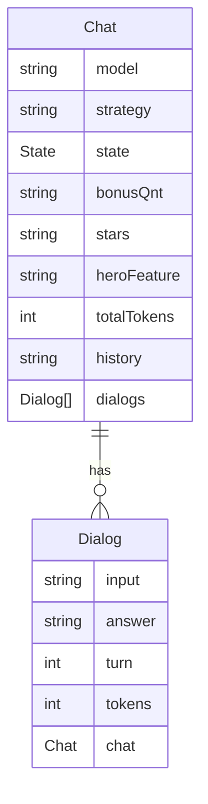

# Blabinha API

Expõe o chatbot Blabinha, um agente especializado sobre a Amazônia Azul, como um serviço de RESTful API.

## Endpoints

- GET `/docs`: retorna informações sobre a API

### Chat Endpoint
- GET `/api/chats/:id`: retorna informações sobre um chat
- POST `/api/chats`: cria um novo chat
- DELETE `/api/chats/:id`: deleta um chat
- GET `/api/chats/:id/dialogs`: retorna uma lista de diálogos associados ao chat

### Dialog Endpoint
- GET `/api/dialogs/:id`: retorna informações sobre um diálogo
- POST `/api/dialogs`: cria um novo diálogo
- DELETE `/api/dialogs/:id`: deleta um diálogo

## Como utilizar

Primeiro crie um chat em `/api/chats`, configurando modelo e estratégia da conversa. Em seguida, intereja com o chat usando `/api/dialogs`. Quando o chat se encerrar o _status_ do chat será atualizado para `closed`.

> [!note] Nota:
> É preciso fornecer uma chave de API para o modelo de LLM selecionado, em todos os diálogos.
> E garantir que essa chave permaneça válida e com tokens disponíveis durante **toda** a vida do chat.


## Diagrama da base de dados



## Como executar

Recomenda-se usar o [`uv` package manager](https://docs.astral.sh/uv/).

Para rodar o projeto siga os seguintes passos:

1. Crie um ambiente virtual com o comando `python -m venv venv` ou `uv venv`.
2. Ative o ambiente virtual com o comando `source venv/bin/activate` (Linux/Mac) ou `venv\Scripts\activate` (Windows).
3. Instale as dependências com o comando `pip install -r requirements.txt` ou  `uv install`.
4. Execute o servidor com o comando `fastapi dev src/main.py`.

Ou também use o Taskipy para executar o projeto:
```bash
task dev
```
Veja [pyproject.toml](pyproject.toml) para ver outros comandos disponíveis.

## Executando migrações

Ao fazer alterações nos modelos e atualizar a base de dados é preciso executar comandos do `alembic`. Veja o exemplo:
```bash
alembic revision --autogenerate -m "campo adicionado na tabela x"
alembic upgrade head
```

Para reverter alterações:
```bash
alembic downgrade -1
```
