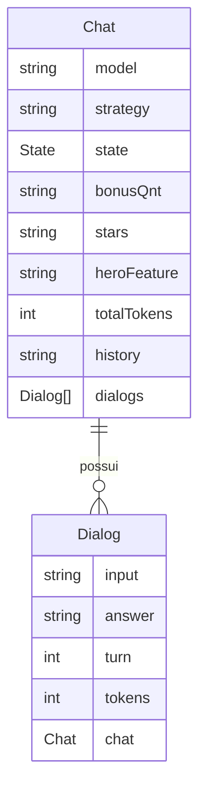

# API Blabinha2.0 (V2)

Um servidor HTTP REST, que expõe o chat-bot Blabinha através da rede, como um serviço de API, permitindo a criação de conversas utilizando diferentes modelos de LLMs e estratégias de prompt. Ligado ao projeto _Blabinha 2.0: um agente conversacional baseado em inteligência artificial generativa, especialista na Amazônia Azul_, do laboratório _Center for Artificial Intelligence_ (C4AI) da Universidade de São Paulo.

## _Features_

- Criar chats: sessões permanentes entre requisições;
- Criar diálogos (_dialogs_): uma seção de intenração com um chat;
- Recuperar dados sobre chats ou diálogos anteriores;
- Apagar dados referentes a chats e diálogos.

## Tecnologias utilizadas

- [FastAPI](https://fastapi.tiangolo.com/), para desenvolver os endpoints e o servidor _HTTP_;
- [SQLModel](https://sqlmodel.tiangolo.com/), para modelar a base de dados e validar as requisições;
- [Alembic](https://alembic.sqlalchemy.org/en/latest/), para organizar e rodar as migrações da base de dados;
- [SQLite](https://sqlite.org/index.html), a base de dados, para armazenar as interações com a Blabinha e armazenar _logs_;
- [UV package manager](https://docs.astral.sh/uv/), para genrenciar e instalar as dependências do projeto.

## Como usar a API

1. Crie um chat com `POST URL/chats`, opcionalmente, com o modelo de LLM desejado, a estratégia de prompt preferida, e a seção que se deseja começar, para iniciar do 'zero' o valor padrão é `100`. A resposta será em _json_, no modelo `Chat`, com o atributo de `id`. **Armazene esse id**;
2. Interaja com o chat por meio de diálogos, com `POST URL/dialogs`, enviando o **id do chat** e o **input desejado**. A resposta será em _json_, no modelo `Dialog`, que contém a resposta gerada por IA, informações sobre aquela seção, e o `Chat` pertencente atualizado.

Para mais informações refira-se à documentação em `URL/docs`.

> `URL` refere-se ao endereço da que API está rodando, se ela estiver localmente, será algo como `http://localhost:8000`, ou similar. Em produção o endereço será fornecido pelo provedor.

## Como rodar a API

1. Clone este repositório: `git clone git@github.com:caio-bernardo/Blabinha2-API.git`;
1.2. **Recomenda-se fortemenete** o uso do package manager `uv`, a instalação é simples: `pip install -g uv`, se deseja mais informações [clique aqui](https://docs.astral.sh/uv/);
2. Para criar o ambiente virtual execute `uv venv venv`; 
2.2 Ative o ambiente: `source venv/bin/activate`;
3. Instale as dependências do projeto: `uv install`;
4. Para rodar o projeto, 

## Desenvolvendo a API


### Fazendo migrações

## Endpoints

- GET `/docs`: retorna informações sobre a API

### Chat Endpoint
- GET `/api/chats/:id`: retorna informações sobre um chat
- POST `/api/chats`: cria um novo chat
- DELETE `/api/chats/:id`: deleta um chat
- GET `/api/chats/:id/dialogs`: retorna uma lista de diálogos associados ao chat

### Dialog Endpoint
- GET `/api/dialogs/:id`: retorna informações sobre um diálogo
- POST `/api/dialogs`: cria um novo diálogo
- DELETE `/api/dialogs/:id`: deleta um diálogo

## Como utilizar

Primeiro crie um chat em `/api/chats`, configurando modelo e estratégia da conversa. Em seguida, intereja com o chat usando `/api/dialogs`. Quando o chat se encerrar o _status_ do chat será atualizado para `closed`.

> [!note] Nota:
> É preciso fornecer uma chave de API para o modelo de LLM selecionado, em todos os diálogos.
> E garantir que essa chave permaneça válida e com tokens disponíveis durante **toda** a vida do chat.


## Diagrama da base de dados



## Como executar

Recomenda-se usar o [`uv` package manager](https://docs.astral.sh/uv/).

Para rodar o projeto siga os seguintes passos:

1. Crie um ambiente virtual com o comando `python -m venv venv` ou `uv venv`.
2. Ative o ambiente virtual com o comando `source venv/bin/activate` (Linux/Mac) ou `venv\Scripts\activate` (Windows).
3. Instale as dependências com o comando `pip install -r requirements.txt` ou  `uv install`.
4. Execute o servidor com o comando `fastapi dev src/main.py`.

Ou também use o Taskipy para executar o projeto:
```bash
task dev
```
Veja [pyproject.toml](pyproject.toml) para ver outros comandos disponíveis.

## Executando migrações

Ao fazer alterações nos modelos e atualizar a base de dados é preciso executar comandos do `alembic`. Veja o exemplo:
```bash
alembic revision --autogenerate -m "campo adicionado na tabela x"
alembic upgrade head
```

Para reverter alterações:
```bash
alembic downgrade -1
```
