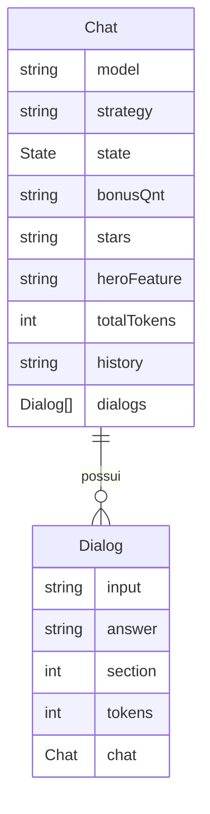

# API Blabinha2.0 (V2)

Um servidor HTTP REST, que expõe o chat-bot Blabinha através da rede, como um serviço de API, permitindo a criação de conversas utilizando diferentes modelos de LLMs e estratégias de prompt. Ligado ao projeto _Blabinha 2.0: um agente conversacional baseado em inteligência artificial generativa, especialista na Amazônia Azul_, do laboratório _Center for Artificial Intelligence_ (C4AI) da Universidade de São Paulo.

## _Features_

- Criar chats: sessões permanentes entre requisições;
- Criar diálogos (_dialogs_): uma seção de intenração com um chat;
- Recuperar dados sobre chats ou diálogos anteriores;
- Apagar dados referentes a chats e diálogos.

## Tecnologias utilizadas

- [FastAPI](https://fastapi.tiangolo.com/), para desenvolver os endpoints e o servidor _HTTP_;
- [SQLModel](https://sqlmodel.tiangolo.com/), para modelar a base de dados e validar as requisições;
- [Alembic](https://alembic.sqlalchemy.org/en/latest/), para organizar e rodar as migrações da base de dados;
- [SQLite](https://sqlite.org/index.html), a base de dados, para armazenar as interações com a Blabinha e armazenar _logs_;
- [UV package manager](https://docs.astral.sh/uv/), para genrenciar e instalar as dependências do projeto.

## Como usar a API

1. Crie um chat com `POST URL/chats`, opcionalmente, com o modelo de LLM desejado, a estratégia de prompt preferida, e a seção que se deseja começar, para iniciar do 'zero' o valor padrão é `100`. A resposta será em _json_, no modelo `Chat`, com o atributo de `id`. **Armazene esse id**;
2. Interaja com o chat por meio de diálogos, com `POST URL/dialogs`, enviando o **id do chat** e o **input desejado**, bem como a chave de API do modelo de LLM escolhido, através do _headers_ no campo `Authorization`, com o formato _Bearer_. A resposta será em _json_, no modelo `Dialog`, que contém a resposta gerada por IA, informações sobre aquela seção, e o `Chat` pertencente atualizado.

Veja um exemplo:

- Criando um chat
```bash
curl -X POST http://localhost:8000/chats -d '{"model": "gpt-4o"}' -H 'Content-Type: application/json'
```
- Criando dialogs
```bash
curl -X POST http://localhost:8000/dialogs -d '{"chat_id": X, "input": "Oi"}' -H 'Content-Type: application/json' -H 'Authorization: Bearer XXXXXXXX'
```

Para mais informações refira-se à documentação em `URL/docs`.

> `URL` refere-se ao endereço da que API está rodando, se ela estiver localmente, será algo como `http://localhost:8000`, ou similar. Em produção o endereço será fornecido pelo provedor.

## Como rodar a API

1. Clone este repositório: `git clone git@github.com:caio-bernardo/Blabinha2-API.git`;
1.2. **Recomenda-se fortemenete** o uso do package manager `uv`, a instalação é simples: `pip install uv`, se deseja mais informações [clique aqui](https://docs.astral.sh/uv/);
2. Rode o comando `uv sync`;
3. Ative o Ambiente virtual `.venv\Scripts\Activate.ps1`;
4. Crie um arquivo chamado ".env" e cole dentro dele esse comando 'DATABASE_URL=sqlite:///db/database.db';
5. Para rodar o projeto em modo de produção: `task run`.

## Desenvolvendo a API

1. Clone este repositório: `git clone git@github.com:caio-bernardo/Blabinha2-API.git`;
1.2. **Recomenda-se fortemenete** o uso do package manager `uv`, a instalação é simples: `pip install -g uv`, se deseja mais informações [clique aqui](https://docs.astral.sh/uv/);
2. Para criar o ambiente virtual execute `uv venv venv`;
2.2 Ative o ambiente: `source venv/bin/activate`;
3. Instale as dependências do projeto: `uv install`;
4. Para rodar o projeto em mode de desenvolvimento: `task dev`, desse modo, alterações vão atualizar imediatamente.

> Lembre-se de criar uma nova _branch_, quando for fazer alterações ao código.

### Fazendo migrações

Ao fazer alterações nos modelos que representam tabelas, é preciso atualizar a base de dados, chamamos isso de **migrações**.
Para fazer isso é preciso executar o comando `alembic`. Veja o exemplo:

Para fazer uma migração:
```bash
alembic revision --autogenerate -m "campo adicionado na tabela x"
alembic upgrade head
```

Para reverter alterações:
```bash
alembic downgrade -1
```
### Estrutura do projeto
```
.
├── db
├── migrations
├── src/
│   ├── app/
│   │   ├── blabinha/
│   │   │   └── Blab.py
│   │   ├── controllers/
│   │   │   ├── blabinha_controller.py
│   │   │   ├── chat_controller.py
│   │   │   └── dialog_controller.py
│   │   ├── models/
│   │   │   ├── chat.py
│   │   │   ├── dialog.py
│   │   │   └── user.py
│   │   ├── repositories/
│   │   │   ├── chat_repo.py
│   │   │   └── dialog_repo.py
│   │   ├── routes/
│   │   │   ├── chats.py
│   │   │   └── dialogs.py
│   │   ├── database.py
│   │   └── dependencies.py
│   └── main.py
├── alembic.ini
├── pyproject.toml
└── README.md
```

#### Diretórios principais
- `db/`: Armazena o banco de dados SQLite
- `migrations/`: Contém os scripts de migração do Alembic
- `src/`: Código-fonte principal da aplicação

#### Estrutura do código-fonte
- `src/main.py`: Ponto de entrada da aplicação, configura e inicializa o servidor FastAPI
- `src/app/database.py`: Configuração da conexão com o banco de dados
- `src/app/dependencies.py`: Define dependências injetáveis para os endpoints (lógica)

#### Blabinha (núcleo)
- `src/app/blabinha/Blab.py`: Implementação principal do chatbot Blabinha

#### Controllers
- `src/app/controllers/blabinha_controller.py`: Gerencia a lógica de negócio do chatbot
- `src/app/controllers/chat_controller.py`: Gerencia as interações entre requisições e a base de dados do chat
- `src/app/controllers/dialog_controller.py`: Gerencia as interações entre requisições e a base de dados do diálogos

#### Models
- `src/app/models/chat.py`: Define o modelo de dados para chats
- `src/app/models/dialog.py`: Define o modelo de dados para diálogos
- `src/app/models/user.py`: Define o modelo de usuário do sistema

#### Repositories
- `src/app/repositories/chat_repo.py`: Implementa operações de CRUD para chats
- `src/app/repositories/dialog_repo.py`: Implementa operações de CRUD para diálogos

#### Routes
- `src/app/routes/chats.py`: Define os endpoints relacionados aos chats
- `src/app/routes/dialogs.py`: Define os endpoints relacionados aos diálogos

#### Arquivos de configuração
- `alembic.ini`: Configuração do Alembic para migrações de banco de dados
- `pyproject.toml`: Configuração do projeto, dependências e metadados

## Diagrama da base de dados

Segue um diagrama da base de dados:

